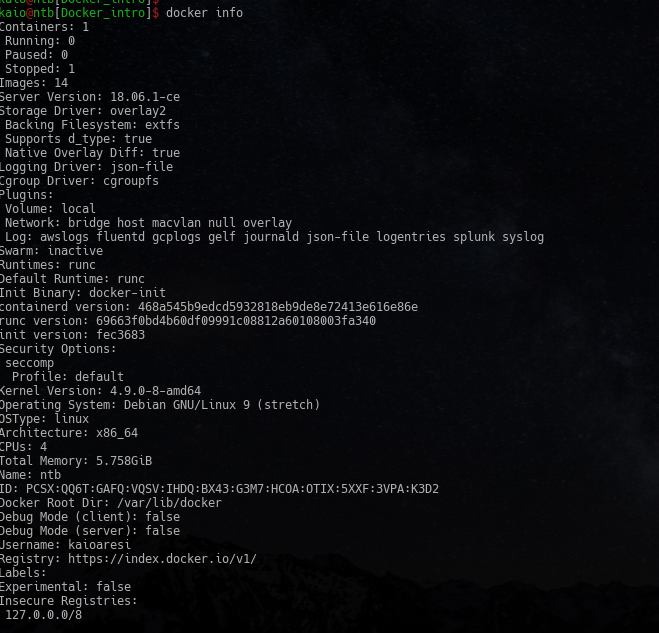

# O que é `container` ?

Container em resumo é uma tecnologia que permite ao enjaulamento de processo e/ou isolamento de contexto, dentro de um host. Containers **não são virtualização**, pois, apenas compartilham recursos do host como `OS` e `Kernel`, já uma virtualização emula um `SO` por completo.

Os containers vieram para permitir que um usuário possam acessar um mesmo recursos, encapsulando processos e recursos de forma que um usuário não impacte outro usuário, ou seja, cada usuário teria o seu próprio ambiente isolado dentro de um mesmo host e/ou OS.

> A ideia do que atualmente chamamos de tecnologia de containers surgiu inicialmente no ano 2000 como jails do FreeBSD, uma tecnologia que permite particionar um sistema FreeBSD em vários subsistemas ou celas (por isso o nome "jails"). Os jails foram desenvolvidos como ambientes seguros que podiam ser compartilhados por um administrador de sistemas com vários usuários internos ou externos à empresa. O propósito do jail era a criação de processos em um ambiente modificado por chroot (no qual o acesso ao sistema de arquivos, rede e usuários é virtualizado), que não pudesse escapar ou comprometer o sistema como um todo. A implementação dele era limitada, e os métodos de escape do ambiente em jail foram descobertos com o tempo.

_https://www.redhat.com/pt-br/topics/containers/whats-a-linux-container_

O LXC (linux containers) é um internface que permite utilizar libs e recursos do kernel linux, através de uma API e algumas ferramentas em baixo nível. O LXC utiliza várias features do kernel, como `namespaces`, `chroots` e `cgroups` dentre outras.


- Kernel namespaces (ipc, uts, mount, pid, network and user)
- Apparmor and SELinux profiles
- Seccomp policies
- Chroots (using pivot_root)
- Kernel capabilities
- CGroups (control groups)

---
# O que é `Docker` ?

`Docker` é uma tecnologia que facilita manusear containers, com o docker você consegue realizar várias funcionalidades com containers de forma muito simples, para mais informações segue [link](https://docs.docker.com/)


---

# O porque trabalhar com containers ?

Containers permitem que uma imagem seja criada e/ou customizada e utilizada de forma simples e rápida por não somente sysadmins, mas também por desenvolvedores de forma simples e pratica. Outros pontos que a utilização de contianers podem te ajuda é na portabilidade de ambiente, você consegue replicar um ambiente rapidamente e sem complicações.

---

# Primeiros passo com `Docker`

## Instalando o docker
Existem alguns meios para realiza a instalanção do `docker`, se você é usuário linux, sua via é bem mais simples você poderá realizar a instalação via `curl`, gerenciado de pacote ou source, já se você é usuário windows até funciona mas eu **NÂO INDICO** por enguanto, existem site que você poderá trabalhar com docker sem muitos problemas, segue link:

- [Linux](https://docs.docker.com/install/linux/docker-ce/centos/)

Bom como falei acima para quem utiliza windows a melhor opção é criar um conta no docker hub e acessar o play with docker, que é uma plataforma gratuita já com docker instalado que lhe permite fazer teste com docker.

- [Play with docker](https://labs.play-with-docker.com/)


---

## Comandos básicos

Após realizar a instalação do docker, vamos checar as informações do mesmo, çomo estamos em 2018 é indicado que você utilize a versão do docker 18.+.


---
**Docker cli - Lógica de utilização**

Para utilizar o docker, primeiramento você deve conher sua logica de comandos, que é bem simple, ele utiliza o formato de subprocess, sequidos por parametros e cada comando possui seus respectivos parametros, vamos aos exemplos:

```
docker <comandos> <parametros>
```

Lista de todos subprocess (comandos).

```
docker container   Manage containers
docker image       Manage images
docker network     Manage networks
docker node        Manage Swarm nodes
docker plugin      Manage plugins
docker secret      Manage Docker secrets
docker service     Manage services
docker stack       Manage Docker stacks
docker swarm       Manage Swarm
docker system      Manage Docker
docker trust       Manage trust on Docker images
docker volume      Manage volumes
```

---

## Agora vamos a pratica

**Informações docker**

Aqui visualizamos todas as informações pertinentes ao docker, como versão, quantidade de imagens, containers e etc.

```
docker info
```



---

**Subindo um container**

Para subir um container na mão temos alguns itens essenciais


```
docker container run <parametros> <image>
```

Parametro | descrição
:---:|:---:
`-t` | exibir dados ssh
`-i` | saída iterativa


Esses parametros foram utilizados pois queremos ver os logs da image em tempo real, esses parametros **NÃO** mantem o container rodando.

Na programação é um pratica muito comum começarmos com o "Hello world", aqui não é diferente.

```
docker container run -ti hello-world
```

Agora vamos subir uma image `nginx`.

Parametro | descrição
:---:|:---:
`-d` | mantem o container executando em background
`--name` | definir um nome no container

```
docker container run -d --name servidor_nginx  nginx
```

**Listando** containers para capturar o `CONTAINER ID`.

```
docker container ls
```

**Deletando** containers

Pré requisito tem um `CONTAINER ID`.

Parametro | descrição
:---:|:---:
`rm` | opção para remover container
`-f` | força a remoção, caso em execução

```
docker contaienr rm -f <CONTAINER ID>
```
